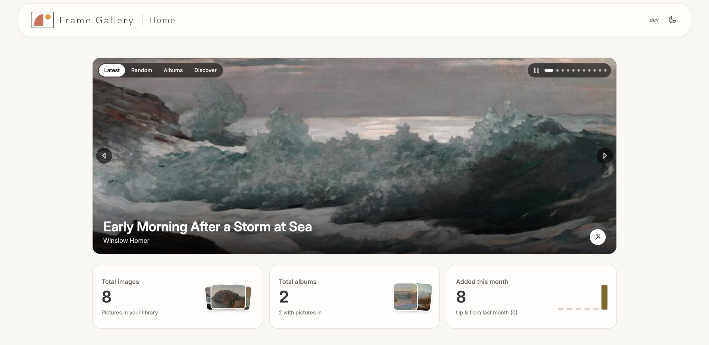
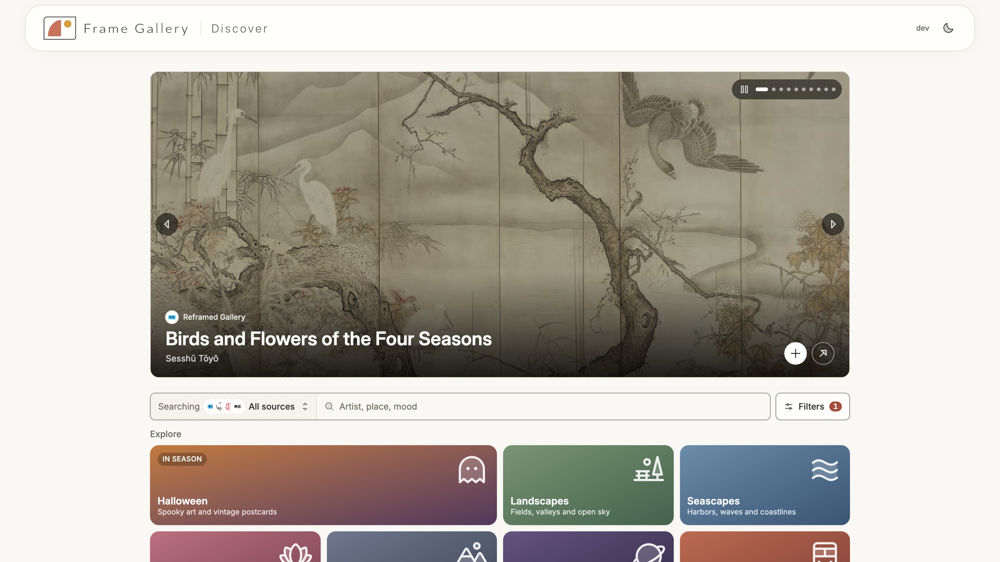
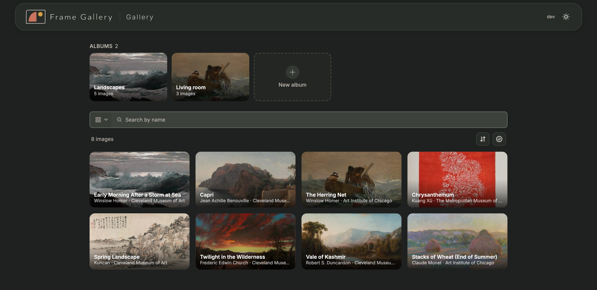
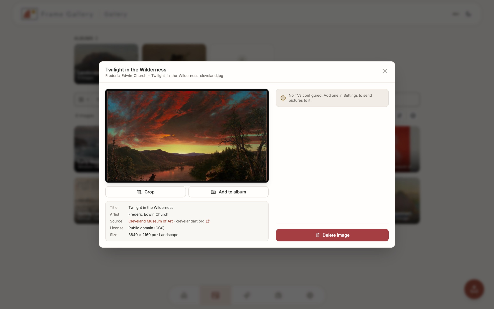
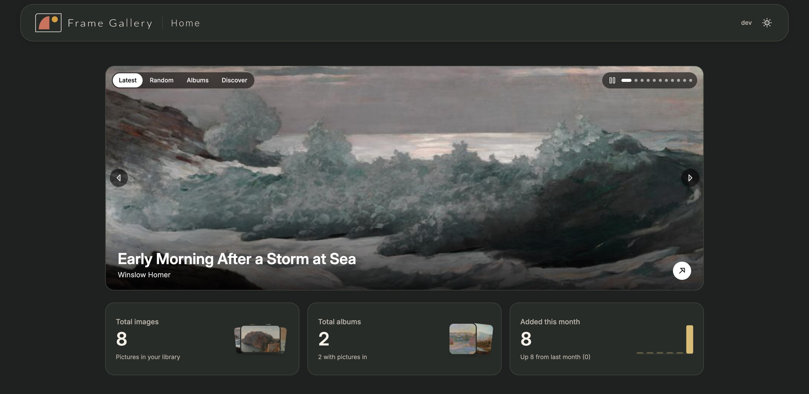

<p align="center">
  <picture>
    <source media="(prefers-color-scheme: dark)" srcset="docs/images/frame-gallery-header-dark.svg">
    <source media="(prefers-color-scheme: light)" srcset="docs/images/frame-gallery-header-light.svg">
    
  </picture>
</p>

<p align="center">
  A self-hosted art gallery for Samsung Frame TVs.<br>
  Find free, museum-quality art, keep it in albums, and send it to your TV in one click.
</p>

<p align="center">
  <a href="LICENSE"></a>
  
  
  <a href="https://github.com/mrtncode/frametv-art-gallery"></a>
</p>

<p align="center">
  
</p>

> **Built on [frametv-art-gallery](https://github.com/mrtncode/frametv-art-gallery) by [mrtncode](https://github.com/mrtncode).**
> The core of this app is their work: talking to the TV, pairing, uploads, the gallery, albums,
> Immich import and the desktop app. Frame Gallery is my personal fork. I redesigned most of the
> interface and added the Discover art sources, and because the changes reach almost every
> screen, it felt presumptuous to send them upstream as a pull request. If you want the original,
> go there, and give it a star.

## What it does

- **Discover** free, high-resolution art from more than 25 sources (the Met, the Art Institute of Chicago, the Getty, the Louvre, NASA and more) and import it already sized for a 16:9 Frame. [See all sources →](docs/sources.md)
- **Keep a gallery** of your own photos, Discover finds and [Immich](https://immich.app/) imports, organised into albums.
- **Send to your TV** in one click, over the TV's own local connection. Manage several Frames at once and run a slideshow.
- **Preview the matte** and crop before anything reaches the TV.
- **Runs on your network.** No accounts, no telemetry, no cloud. Light and dark themes, works on a phone.

<p align="center">
  
  
</p>
<p align="center">
  
  
</p>

## Quick start

Run it with Docker Compose. Images are published to `ghcr.io/bballdavis/frame-gallery` for amd64 and arm64 with each release.

```yaml
services:
  frame-gallery:
    image: ghcr.io/bballdavis/frame-gallery:latest
    container_name: frame-gallery
    restart: unless-stopped
    network_mode: host        # lets the app find TVs on your network
    environment:
      - FRAME_TV_DATA=/data
      - PORT=8005
      - SECRET_KEY=change-me
    volumes:
      - frame_gallery_data:/data

volumes:
  frame_gallery_data:
```

Open `http://<your-server>:8005`, go to **Settings**, and add your TV. Accept the prompt on the TV the first time it connects.

**Updating:** `docker compose pull && docker compose up -d`. Database migrations run on start. Your gallery and database live in the `/data` volume, so **back it up before updating**.

**Building it yourself:** the image can also be built from a plain checkout, frontend included:

```bash
git clone https://github.com/bballdavis/Frame-Gallery.git
cd Frame-Gallery
docker build -f backend/Dockerfile.full -t frame-gallery .
```

Desktop builds for Windows, macOS and Linux are attached to each [release](https://github.com/bballdavis/Frame-Gallery/releases).

More options: [Configuration](docs/configuration.md) · [Troubleshooting](docs/troubleshooting.md) · [Development and desktop builds](docs/development.md)

## Security

Frame Gallery has **no login**. Anyone who can reach it can control your TVs and change your gallery.

- Keep it on your home network. Do not expose it to the internet.
- For remote access, use a VPN or a reverse proxy that adds authentication.
- Set your own `SECRET_KEY`.

Details, including how keys for Discover sources are stored, are in [SECURITY.md](SECURITY.md).

## Documentation

| Page | What's in it |
| --- | --- |
| [Discover sources](docs/sources.md) | Every art source, its license, which need a free key, and how framing works |
| [Configuration](docs/configuration.md) | Environment variables, data volume, TV timeouts |
| [Troubleshooting](docs/troubleshooting.md) | TV not found, busy, timeouts, upload errors |
| [Development](docs/development.md) | Running locally, tests, desktop app builds, architecture |
| [Security](SECURITY.md) | Threat model, hardening and reporting a problem |

## Credits

- **[mrtncode](https://github.com/mrtncode)** created [frametv-art-gallery](https://github.com/mrtncode/frametv-art-gallery), which this is built on, with contributions from its community.
- **[samsung-tv-ws-api](https://github.com/xchwarze/samsung-tv-ws-api)** by xchwarze handles the TV connection.
- **[Reframed Gallery](https://www.reframed.gallery/)** curates art cropped for the Frame. Please [tip them](https://ko-fi.com/O5O51FWPUL).
- The museums and archives listed in [Discover sources](docs/sources.md) make their collections free to use.
- Loading animation from [LottieFiles](https://lottiefiles.com/free-animation/image-VXYNYReCmq).

## License and disclaimer

[AGPL-3.0](LICENSE), the same license as the original project.

Frame Gallery is an unofficial hobby project. It is **not affiliated with, endorsed by or sponsored by Samsung**. "The Frame" is a Samsung trademark. The software is provided as is, without warranty. You use it at your own risk.
