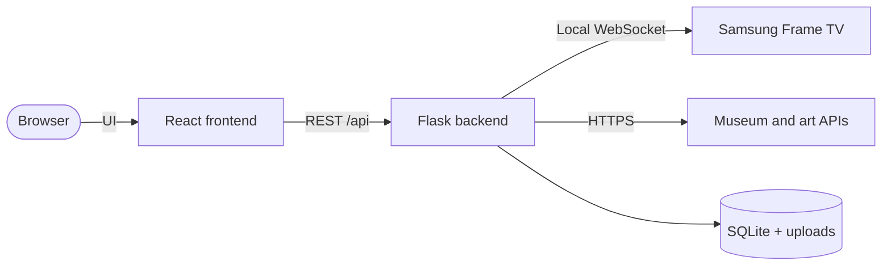

# Development

[← Back to README](../README.md)

## Architecture



| Part | Stack |
| --- | --- |
| `frontend/` | React Router (SPA), TypeScript, Tailwind CSS, shadcn/ui and Radix, Lottie |
| `backend/` | Flask, SQLAlchemy and Alembic migrations, gunicorn, [samsung-tv-ws-api](https://github.com/xchwarze/samsung-tv-ws-api) |
| `backend/utils/discover/` | One module per Discover source |
| `frontend/theme/` | Brand guide and design tokens |
| `frontend/main.js` | Electron shell for the desktop app |

## Run locally

Backend (Python 3.11+):

```bash
cd backend
python -m venv ../.venv && ../.venv/bin/pip install -e ".[test]"
FRAME_TV_DATA=./data BACKEND_PORT=5055 ../.venv/bin/python app.py
```

Frontend ([pnpm](https://pnpm.io/)):

```bash
cd frontend
pnpm install
VITE_API_URL=http://localhost:5055 pnpm dev
```

Open `http://localhost:5173`.

## Tests

```bash
cd backend
pytest
```

```bash
cd frontend
pnpm typecheck
```

## Docker image

`backend/Dockerfile.full` builds everything from a plain checkout, frontend included:

```bash
docker build -f backend/Dockerfile.full -t frame-gallery .
```

`backend/Dockerfile` is the upstream version used by CI. It expects `frontend/build/client` to be built first.

## Desktop app

The desktop app bundles the backend with PyInstaller and wraps the frontend in Electron.

Build the backend:

```bash
cd backend
python -m PyInstaller --clean --distpath ./build-backend flask_backend.spec
```

Run or package the app:

```bash
cd frontend
pnpm electron:start
```

`electron:start` needs `pnpm dev` running in another terminal. Use `pnpm electron:dist` for a packaged build.

## Releasing

Publishing a GitHub release (tagged like `v2.2.0`) runs two workflows:

- **Build and publish Docker image** pushes `ghcr.io/bballdavis/frame-gallery` tagged `latest` and the release tag, for amd64 and arm64.
- **Build Desktop Apps** attaches Windows, macOS and Linux builds to the release.

The running app compares its version with the latest release here once a day and offers an update when a newer one exists. After the first image is published, set the package's visibility to public in the GitHub package settings so it can be pulled without logging in.

## Conventions

- Commits follow [Conventional Commits](https://www.conventionalcommits.org/) (`feat:`, `fix:`, `perf:`, `chore:`).
- Branches use a type prefix, such as `feat/` or `fix/`.
- Discover sources must only offer art with a reusable license, or be flagged and off by default. See [Discover sources](sources.md).
